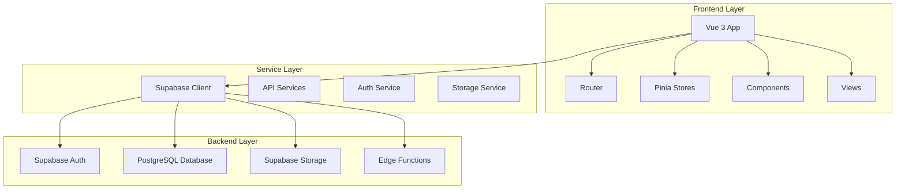

# Design Document

## Overview

This design document outlines the architecture and implementation approach for a modern, responsive ERP frontend system built with Vue 3, TypeScript, and Tailwind CSS. The system will provide comprehensive business management capabilities for multi-company operations, integrating with a Supabase backend that follows SUNAT compliance requirements for Peruvian businesses.

The application will feature a modular architecture with clear separation of concerns, supporting real-time inventory management, electronic invoicing, POS functionality, and comprehensive reporting capabilities.

## Architecture

### High-Level Architecture



### Technology Stack

**Core Framework:**

- Vue 3 with Composition API and `<script setup>`
- TypeScript for type safety
- Vite for build tooling and development server

**UI/UX:**

- Tailwind CSS for styling with dark/light mode support
- Headless UI for accessible components
- lucide-vue-next for consistent iconography
- VueUse Motion for smooth animations

**State Management:**

- Pinia for global state management
- Vue's reactive system for local component state

**Forms and Validation:**

- VeeValidate for form handling
- Yup for schema validation

**Data Visualization:**

- ApexCharts for dashboard charts and analytics
- TanStack Table for advanced data tables

**Backend Integration:**

- @supabase/supabase-js for database and auth
- Supabase Storage for file uploads

**Additional Features:**

- Vue I18n for internationalization
- Vite PWA for offline capabilities
- Three.js for 3D warehouse visualization

## Components and Interfaces

### Core Layout Components

#### AppLayout

Main application shell with responsive design:

- Collapsible sidebar navigation
- Top navigation bar with user menu
- Main content area with breadcrumbs
- Theme toggle and company selector

#### Sidebar Navigation

Hierarchical navigation structure:

```typescript
interface NavigationItem {
  id: string
  label: string
  icon: string
  route?: string
  children?: NavigationItem[]
  permissions?: string[]
}
```

#### TopNavbar

Contains:

- Global search (Ctrl+K shortcut)
- Notifications dropdown
- Company selector
- User profile menu
- Theme toggle

### Form Components

#### BaseForm

Reusable form wrapper with VeeValidate integration:

```typescript
interface FormProps {
  schema: ObjectSchema<any>
  initialValues?: Record<string, any>
  onSubmit: (values: any) => Promise<void>
  loading?: boolean
}
```

#### FormWizard

Multi-step form component for complex data entry:

```typescript
interface WizardStep {
  id: string
  title: string
  component: Component
  validation?: ObjectSchema<any>
  canSkip?: boolean
}
```

#### DynamicForm

JSON-driven form generator for flexible form creation:

```typescript
interface FormField {
  name: string
  type: 'text' | 'number' | 'select' | 'date' | 'file' | 'textarea'
  label: string
  required?: boolean
  options?: Array<{ value: any; label: string }>
  validation?: any
}
```

### Data Display Components

#### DataTable

Advanced table component with TanStack Table:

- Sorting, filtering, pagination
- Column visibility controls
- Export functionality
- Row selection and bulk actions

#### Dashboard Cards

Modular dashboard components:

- KPI cards with trend indicators
- Chart widgets (line, bar, pie, donut)
- Recent activity feeds
- Quick action buttons

### Business-Specific Components

#### ProductSelector

Smart product selection with:

- Barcode scanning support
- Real-time stock display
- Price list integration
- Image preview

#### PartySelector

Customer/supplier selection with:

- Document validation
- Quick creation modal
- Contact information display
- Transaction history

#### WarehouseViewer3D

Three.js-based 3D warehouse visualization:

- Interactive zone navigation
- Stock level visualization
- Capacity utilization display

## Data Models

### Core Types

```typescript
// Company and Organization
interface Company {
  id: string
  ruc: string
  legal_name: string
  trade_name?: string
  email?: string
  phone?: string
  address?: string
  ubigeo_code?: string
  currency_code: string
  valuation_method: 'PROMEDIO_MOVIL' | 'FIFO'
  created_at: string
  updated_at: string
}

interface Branch {
  id: string
  company_id: string
  code: string
  name: string
  address?: string
  ubigeo_code?: string
}

interface Warehouse {
  id: string
  company_id: string
  branch_id?: string
  code: string
  name: string
  width: number
  height: number
  length: number
  volume_m3: number
}

// Products and Inventory
interface Product {
  id: string
  company_id: string
  sku: string
  barcode?: string
  name: string
  description?: string
  brand_id?: string
  category_id?: string
  unit_code: string
  width: number
  height: number
  length: number
  weight_kg: number
  volume_m3: number
  is_serialized: boolean
  is_batch_controlled: boolean
  min_stock: number
  max_stock: number
  active: boolean
}

interface StockLedger {
  id: string
  company_id: string
  warehouse_id: string
  product_id: string
  movement_date: string
  ref_doc_type?: string
  ref_doc_series?: string
  ref_doc_number?: string
  operation_type?: string
  qty_in: number
  qty_out: number
  unit_cost_in?: number
  total_cost_in?: number
  unit_cost_out?: number
  total_cost_out?: number
  balance_qty: number
  balance_unit_cost?: number
  balance_total_cost?: number
  source?: string
  source_id?: string
}

// Sales and Purchases
interface SalesDoc {
  id: string
  company_id: string
  branch_id?: string
  customer_id: string
  doc_type: string
  series: string
  number: number
  issue_date: string
  currency_code: string
  exchange_rate?: number
  total: number
  greenter_status?: string
  items: SalesDocItem[]
}

interface SalesDocItem {
  id: string
  sales_doc_id: string
  product_id: string
  description?: string
  unit_code: string
  quantity: number
  unit_price: number
  discount_pct: number
  igv_amount: number
  total_line: number
}

// Parties (Customers/Suppliers)
interface Party {
  id: string
  company_id: string
  is_customer: boolean
  is_supplier: boolean
  doc_type: string
  doc_number: string
  apellido_paterno?: string
  apellido_materno?: string
  nombres?: string
  razon_social?: string
  fullname: string
  email?: string
  phone?: string
  address?: string
  ubigeo_code?: string
}
```

### Store Interfaces

```typescript
// Auth Store
interface AuthState {
  user: User | null
  session: Session | null
  currentCompany: Company | null
  availableCompanies: Company[]
  loading: boolean
}

// UI Store
interface UIState {
  sidebarCollapsed: boolean
  theme: 'light' | 'dark'
  locale: string
  notifications: Notification[]
  globalSearch: {
    open: boolean
    query: string
    results: SearchResult[]
  }
}

// Inventory Store
interface InventoryState {
  products: Product[]
  categories: Category[]
  brands: Brand[]
  warehouses: Warehouse[]
  currentStock: Record<string, number>
  loading: boolean
}
```

## Error Handling

### Error Types

```typescript
interface AppError {
  code: string
  message: string
  details?: any
  timestamp: string
}

interface ValidationError extends AppError {
  field: string
  value: any
}

interface NetworkError extends AppError {
  status: number
  endpoint: string
}
```

### Error Handling Strategy

1. **Global Error Handler**: Catch unhandled errors and display user-friendly messages
2. **Form Validation**: Real-time validation with clear error messages
3. **Network Errors**: Retry mechanisms and offline handling
4. **Business Logic Errors**: Context-aware error messages with suggested actions

### Error Boundaries

```typescript
// Global error handler
app.config.errorHandler = (error, instance, info) => {
  console.error('Global error:', error, info)
  // Send to error reporting service
  // Show user notification
}
```

## Testing Strategy

### Unit Testing

- **Framework**: Vitest
- **Coverage**: Components, composables, utilities
- **Mocking**: Supabase client, external APIs

### Integration Testing

- **Framework**: Cypress or Playwright
- **Coverage**: User workflows, form submissions, navigation

### E2E Testing

- **Framework**: Playwright
- **Coverage**: Critical business processes (sales, inventory, reporting)

### Testing Structure

```
tests/
├── unit/
│   ├── components/
│   ├── composables/
│   └── utils/
├── integration/
│   ├── auth/
│   ├── inventory/
│   └── sales/
└── e2e/
    ├── user-workflows/
    └── business-processes/
```

## Performance Optimization

### Code Splitting

- Route-based code splitting
- Component lazy loading
- Dynamic imports for heavy libraries

### Caching Strategy

- Supabase query caching
- Image optimization and caching
- Service worker for offline data

### Bundle Optimization

- Tree shaking for unused code
- Compression and minification
- CDN for static assets

## Security Considerations

### Authentication & Authorization

- Supabase Auth integration
- JWT token management
- Role-based access control (RBAC)
- Session timeout handling

### Data Protection

- Input sanitization
- XSS prevention
- CSRF protection
- Secure API communication (HTTPS)

### Company Data Isolation

- Row Level Security (RLS) in Supabase
- Company context validation
- Audit logging for sensitive operations

## Internationalization

### Supported Languages

- Spanish (primary)
- English (secondary)

### Implementation

```typescript
// i18n configuration
const messages = {
  es: {
    nav: {
      dashboard: 'Panel de Control',
      products: 'Productos',
      sales: 'Ventas',
    },
  },
  en: {
    nav: {
      dashboard: 'Dashboard',
      products: 'Products',
      sales: 'Sales',
    },
  },
}
```

### Localization Features

- Date/time formatting
- Number formatting (currency, decimals)
- SUNAT-specific terminology
- RTL support preparation

## Accessibility

### WCAG 2.1 AA Compliance

- Semantic HTML structure
- ARIA labels and roles
- Keyboard navigation support
- Screen reader compatibility

### Implementation

- Focus management
- Color contrast compliance
- Alternative text for images
- Form labels and descriptions

## Progressive Web App (PWA)

### Features

- Offline functionality
- Push notifications
- App-like experience
- Background sync

### Service Worker Strategy

- Cache-first for static assets
- Network-first for dynamic data
- Background sync for form submissions
- Offline fallback pages

## Module-Specific Design

### Dashboard Module

- Real-time KPI widgets
- Customizable layout
- Interactive charts
- Quick actions panel

### Inventory Module

- Product catalog with search/filter
- Stock level monitoring
- Warehouse 3D visualization
- Transfer management

### Sales Module

- POS interface for quick sales
- Invoice generation
- Customer management
- Payment processing

### Reporting Module

- SUNAT format exports (12.1, 13.1)
- Custom report builder
- Scheduled reports
- Data visualization

### Electronic Invoicing

- Greenter integration
- XML generation and validation
- SUNAT submission handling
- CDR processing and storage

This design provides a solid foundation for building a comprehensive ERP system that meets the requirements while maintaining scalability, performance, and user experience standards.
